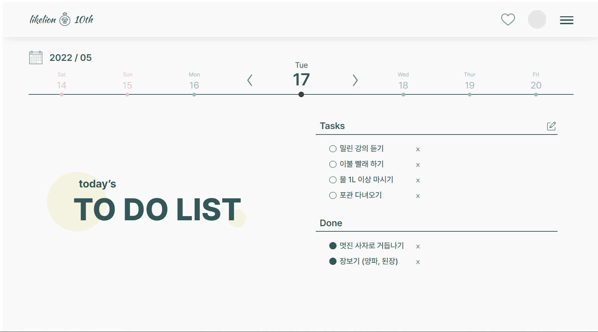

# 10th-Todo-publishing
프론트엔드 : Todo UI 퍼블리싱 과제 

## 기획디자인 곽은진(geeeezin)
## 프론트엔드 이서진(529539)


### 🖥️ 완성본



### [GitHub 링크](https://github.com/529539/10th-Todo-publishing)

### [netlify 링크](https://todo-geeeezin-529539.netlify.app/)
deploy도 한번 해봤습니다 부꾸럽지만 나름 제 첫 페이지니까요...^//^

### ⛔ 미해결 이슈

- 리스트를 2개의 단으로 나누기
(4개 이상 작성되면 다음 단인 오른쪽으로 넘어가야 하는데 그냥 아래로 계속 이어짐.
조건문으로 5개부터 새로운 `<ul>`에 작성되게 하기? 도전은 해봤는데 아무튼 구현은 못함..)
    

    
- 리스트끼리 띄워두려고 `<li>`에 `line-height` 속성을 주었더니
하나의 `<li>` 내에서도 내용이 길어져 2줄로 넘어가면 줄간격이 너무 큼
또, 줄바꿈되었을 때 텍스트가 시작된 부분에서 2번째 줄이 시작되는 것이 아니라
`<li>`의 모양으로 주었던 체크박스 이미지 전까지 앞으로 붙어나옴
    

    
- 전부 `position: absolute;` 설정하여 픽셀로 위치를 설정함....
아직 `position: relative;` , `float` , `margin` , `padding` 사용하는게 어렵다🥲
- 스크린의 크기를 처음부터 `1920 × 1080px`로 설정해서 창을 전체화면으로 봐도 모니터 크기에 따라 스크롤이 생김ㅜㅜ
- 날짜별로 각각 새로운 투두를 작성할 수 없음
(오늘 하루치에만 고정되어 있음, 또 날짜가 자동으로 바뀌는 것까지는 구현하지 못하고
텍스트로 적어두기만 함..)

### 💡 어려웠던 점과 해결 방법

- Figma를 처음 사용해보는 것이었어서 처음엔 감이 안잡혔는데 열심히 구글링해가면서 해결했다.
FIgma to HTML이라는 플러그인을 발견해서 써봤는데
클래스, 아이디 이름도 뒤죽박죽이고 전부 div 태그에 CSS를 적용한 방식으로 변환되어서 결국 거의 새로 짜긴 했다. ㅎㅎ
그래도 Figma에서 바로 CSS 코드를 복사해서 쓸 수 있는건 완전 대박 편하고 좋았다!!👍
- 세션에서 짜뒀던 JavaScript 코드는 텍스트를 클릭했을 때 todo에서 done으로 토글되는 거였는데, 이 페이지를 구현할 때는 텍스트가 아니라 체크박스(빈 원 → 채워진 원)를 클릭했을 때 토글되어야 했어서 js 코드를 수정하는 것이 어려웠다.
    
    우선 리스트의 모양을 이미지로 바꿔야 했는데,
    
    ```jsx
    const newTodoCircle = document.createElement("img");
    newTodo.appendChild(newTodoCircle);
    
    newTodoCircle.className = "todo-circle";
    newTodoCircle.setAttribute("src", "images/circle_empty.png");
    newTodoCircle.addEventListener("click", toggleTodoToDone);
    ```
    
    `<li>` 안에 ``를 생성하고 속성에 이미지 경로를 준 뒤 이벤트를 추가하는 식으로 코드를 수정했다.
    
    여기서 원래는 텍스트를 클릭했기 때문에 바로 해당 `<span>` 안의 innerText를 출력하기만 하면 됐었는데, 지금은 ``를 클릭하는 것이기 때문에 토글 함수도 다음과 같이 수정했다.
    
    ```jsx
    const toggleTodoToDone = (e) => {
      deleteTodoItem(e);
      var li = e.target.parentNode;
      var text = li.childNodes[1];
      printDoneItem(text.innerText);
    };
    ```
    
    타겟인 ``의 부모 태그인 `<li>`를 저장해두고, `<li>`의 자손 노트 중 2번째 태그인 `<span>`을 따로 또 저장하여 innerText를 출력하게 했다.
    
    `toggleDoneToTodo`도 같은 방식으로 수정하니까 원하는 결과를 얻을 수 있었다.🎉
